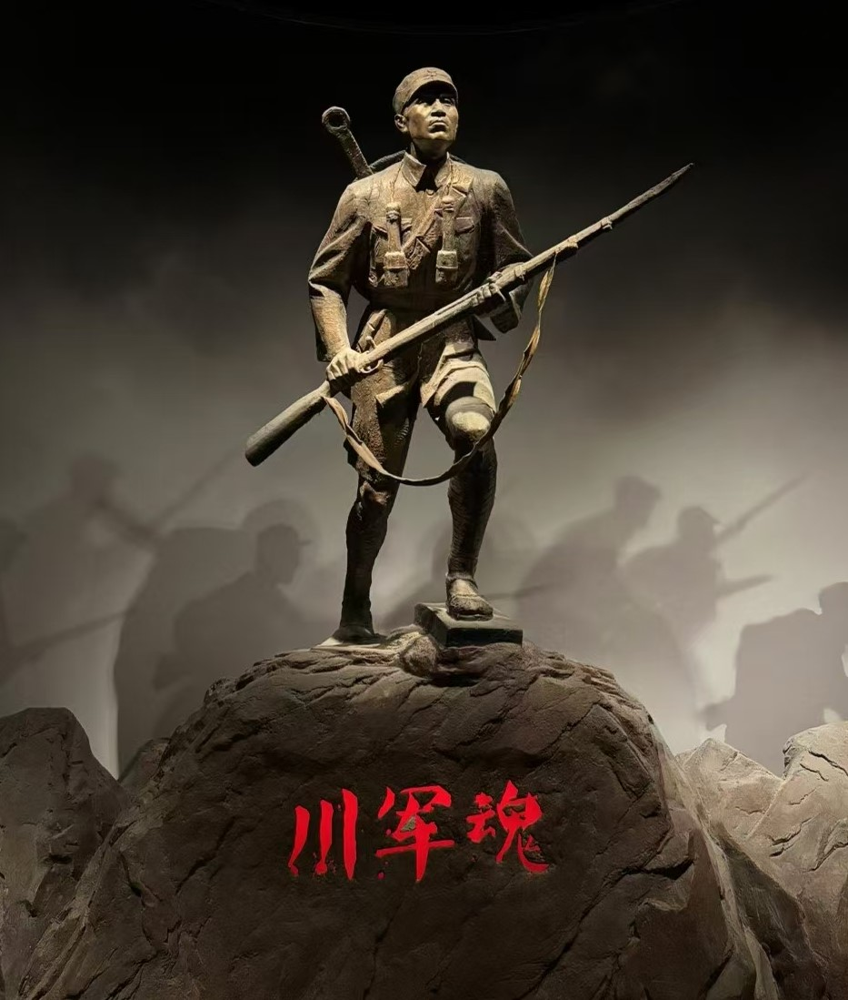
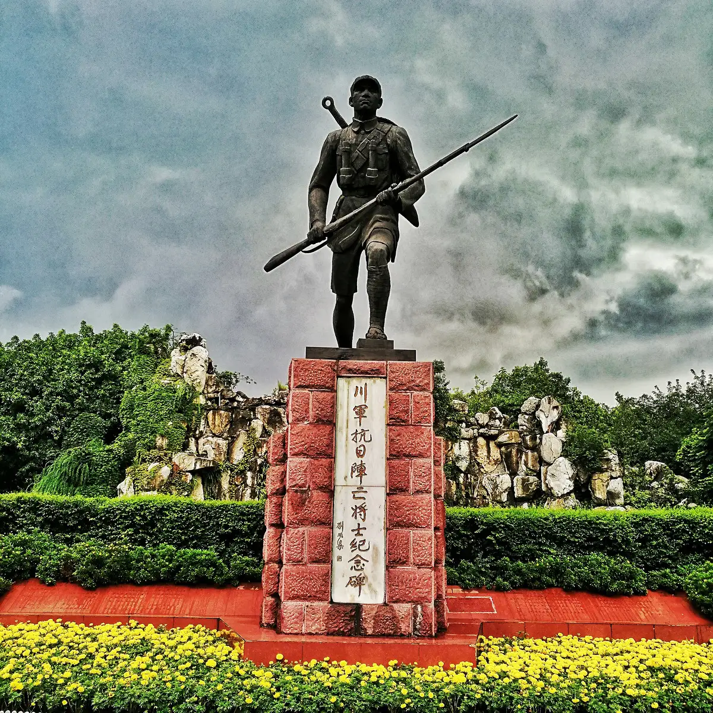

## Hi there 👋

### 📊 GitHub Stats

  
  

### 🚀 About Me

- 🔭 I’m currently working on microseismic location and AI applications in earthquake location.
- 🌱 I’m currently learning seismology and PINNs.
- 👯 I’m looking for a collaborator to participate in the [International Contest on Aftershock Forecasting](https://tianchi.aliyun.com/competition/entrance/532460).
- 🤔 I’m a member of [GenericMappingTools](https://github.com/GenericMappingTools) and [gmt-china](https://github.com/gmt-china).
- 💬 Ask me about phase picking and first-motion determination.
- 📫 How to reach me: chuanjun1978@gmail.com
- 😄 Dream: The great rejuvenation of the Chinese nation.

### 📸 Gallery

  
<i>我们永远怀念 Forever in our hearts</i>

   
  
  &nbsp;&nbsp;&nbsp;
  

